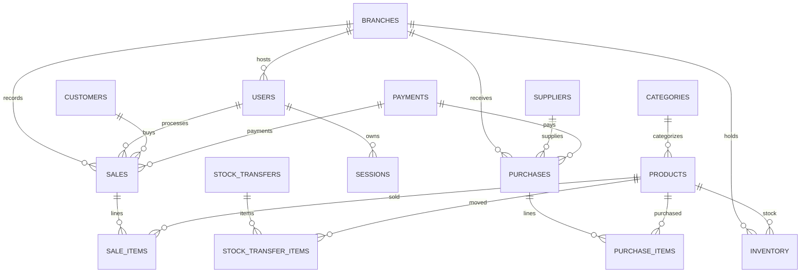

# ERP Database ERD (Mermaid)

Notes:
- `users.role` is kept as a string enum for simplicity.
- `inventory` stores per-branch stock and last known cost for moving-average calculations.
- `payments` is a simplified ledger for supplier/customer payments and expense payments.

You can render the above Mermaid diagram in any markdown viewer that supports Mermaid.
